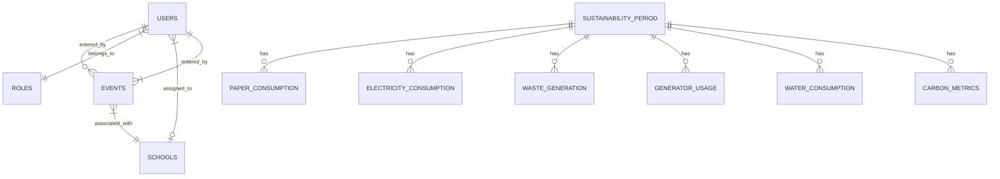

## 📊 Entity Relationship Diagram

> [!TIP]
> A raw Oracle SQL script is available here: [DATABASE_SETUP.sql](DATABASE_SETUP.sql) for manual schema initialization.

---

## 🔑 Core Tables

### 1. `USERS`
Stores system users and their authentication details.
- `USER_ID` (NUMBER, PK): Unique identifier.
- `FULL_NAME` (VARCHAR2): Display name.
- `EMAIL` (VARCHAR2, UNIQUE): Login identifier.
- `PASSWORD` (VARCHAR2): Hashed password.
- `ROLE_ID` (NUMBER, FK): References `ROLES`.
- `SCHOOL_ID` (NUMBER, FK, Nullable): References `SCHOOLS`.

### 2. `ROLES`
Definitions of access levels.
- `ROLE_ID` (NUMBER, PK): 1: Admin, 2: Coordinator, 3: HR, 4: Student Affairs, 5: Marketing, 6: Carbon Accountant, 21: Management.
- `ROLE_NAME` (VARCHAR2): Display name.

### 3. `SUSTAINABILITY_PERIOD`
The temporal anchor for all monthly metrics.
- `PERIOD_ID` (NUMBER, PK): Unique identifier.
- `DATA_MONTH` (NUMBER): 1-12.
- `DATA_YEAR` (NUMBER): e.g., 2026.
- `STUDENTS` (NUMBER): Total student headcount for that month.
- `EMPLOYEES` (NUMBER): Total employee headcount for that month.

---

## 🌿 Sustainability Metric Tables

All metrics link to a specific `SUSTAINABILITY_PERIOD`.

### 4. `PAPER_CONSUMPTION`
- `PAPER_ID` (NUMBER, PK)
- `PERIOD_ID` (NUMBER, FK)
- `PAPER_REAMS` (NUMBER)
- `SHEETS_PER_REAM` (NUMBER)
- `PER_CAPITA_REAM` (NUMBER)

### 5. `ELECTRICITY_CONSUMPTION`
- `ELECTRICITY_ID` (NUMBER, PK)
- `PERIOD_ID` (NUMBER, FK)
- `UNITS_KWH` (NUMBER)
- `TOTAL_COST` (NUMBER)
- `KWH_SOLAR_OFFSET` (NUMBER)

### 6. `GENERATOR_USAGE`
- `GENERATOR_ID` (NUMBER, PK)
- `PERIOD_ID` (NUMBER, FK)
- `TOTAL_HOURS` (NUMBER)
- `DIESEL_LITRES` (NUMBER)
- `FUEL_TYPE` (VARCHAR2)
- `COST` (NUMBER)

### 7. `CARBON_METRICS`
- `CARBON_ID` (NUMBER, PK)
- `PERIOD_ID` (NUMBER, FK)
- `AQI_SCORE` (NUMBER)
- `CARBON_FOOTPRINT` (NUMBER): tCO₂e.

---

## 📅 Events & Initiatives

### 8. `EVENTS`
- `EVENT_ID` (NUMBER, PK)
- `SCHOOL_ID` (NUMBER, FK): Originating department.
- `EVENT_MONTH` / `EVENT_YEAR` / `EVENT_DATE`
- `EVENT_NAME` / `EVENT_TYPE`
- `DESCRIPTION` (CLOB/TEXT)
- **`EVENT_LINK`** (VARCHAR2): URL to documentation/report.
- `ENTERED_BY` (NUMBER, FK): Reference to `USERS`.

---

## 💡 Oracle 19c Implementation Notes

1. **Auto-Increment**: Handled by Laravel's `BigIncrements` which translates to `IDENTITY` columns or `SEQUENCES` + `TRIGGERS` depending on schema configuration.
2. **Boolean Logic**: Oracle does not have a native `BOOLEAN` type. Use `NUMBER(1)` with values `0` and `1`.
3. **Null vs Empty**: Oracle treats empty strings (`''`) as `NULL`. The backend code handles this by ensuring optional fields are persisted as `null`.
4. **Dates**: Use `DATE` for calendar dates and `TIMESTAMP` for precision audit logs.
